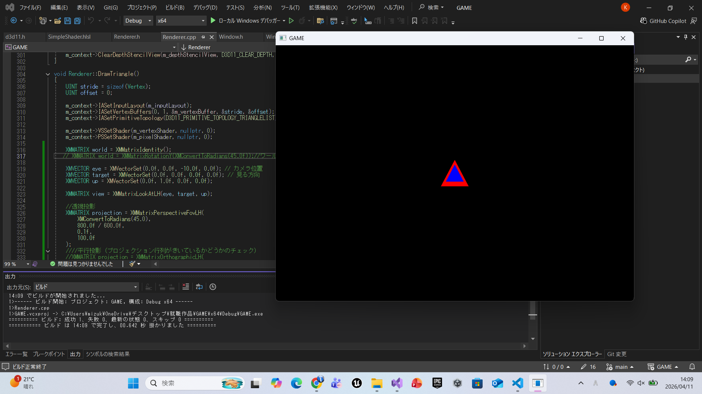
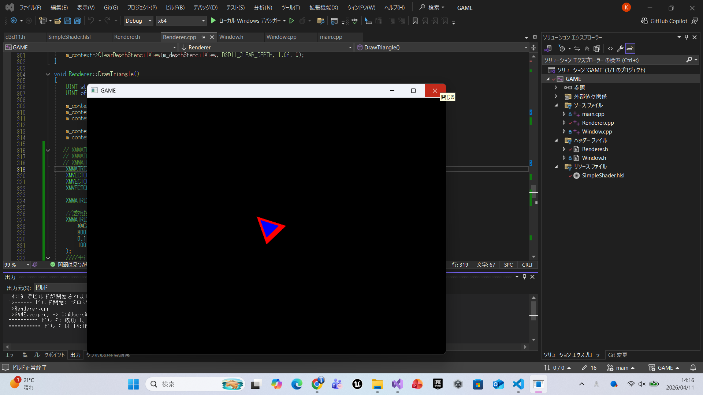
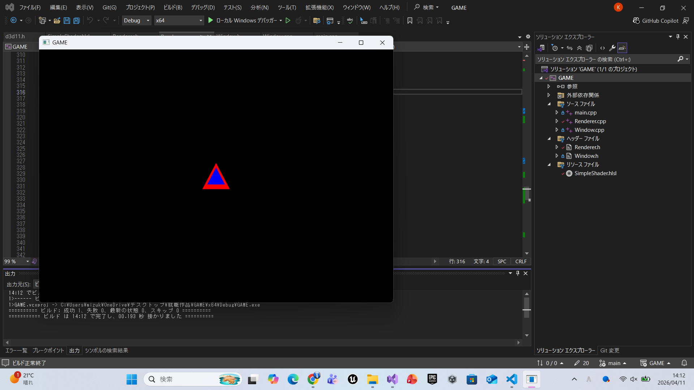
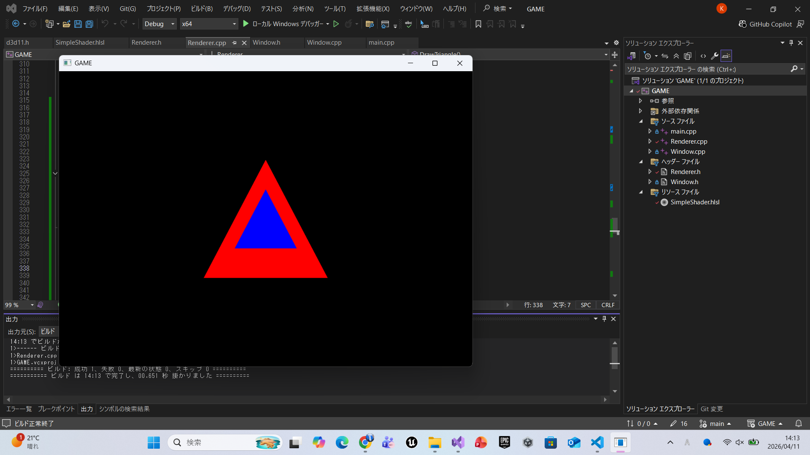

# DirectXGame

DirectX11を使用して作成している C++ のゲームプロジェクトです。

## 概要
DirectX11を用いた描画処理の学習と、就職作品としての開発を目的に制作しています。
現在は3D描画の基礎となるWVP行列を導入し、透視投影および平行投影の理解と実装を進めています。

## 現在の実装内容
- ウィンドウ生成
- Rendererクラスによる描画管理
- DirectX11の初期化
- HLSLシェーダーの読み込み
- 三角形の描画
- 深度バッファ（Zバッファ）の実装
- WVP行列（World・View・Projection）の導入
- ワールド行列によるオブジェクトの回転
- ビュー行列によるカメラ制御（基礎）
- 透視投影と平行投影の実装と検証
- Git / GitHubによるバージョン管理

## 使用技術
- C++
- DirectX11
- HLSL
- Visual Studio
- Git / GitHub

## 実行方法
1. Visual Studio で `GAME.sln` を開く
2. ビルド構成を `Debug` または `Release` に設定
3. 実行する
## 実行結果

### 回転無し（World Matrix）

### Z軸回転（World Matrix）

### 透視投影（Perspective Projection）

### 平行投影（Orthographic Projection）

## 理解したこと

### 深度バッファ（Depth Buffer）
深度バッファを導入することで、Z値に基づいた前後関係の判定が可能となり、
オブジェクトの隠面消去（Hidden Surface Removal）が正しく行われることを理解しました。

### WVP行列
3D空間の座標を画面へ投影するためには、World・View・Projectionの3つの行列が必要であることを学びました。

- **World行列**：オブジェクトの位置・回転・拡大縮小を決定する。
- **View行列**：カメラの位置と向きを決定する。
- **Projection行列**：3D空間を2D画面へ投影する。

WVP = World × View × Projection

### 透視投影と平行投影
透視投影と平行投影の違いを理解しました。

- **透視投影（Perspective Projection）**  
  x座標とy座標をzの奥行きに基づいて変換することで、遠くの物体ほど小さく見える遠近感を表現する。

- **平行投影（Orthographic Projection）**  
  zの奥行きによって大きさが変化せず、距離に関係なく同じ大きさで表示される投影方式。

UIなどには平行投影を、3D空間を表現する際には透視投影を用いることで適切な使い分けが可能であると理解しました。

## 今後の実装予定
- カメラ制御
- モデル読み込み
- プレイヤー実装
- シーン管理

## 制作意図
DirectX を用いたゲーム開発の基礎理解と、設計・描画・管理の流れを段階的に学ぶために制作しています。  
機能を一つずつ実装しながら、ゲームとして完成度を高めていく予定です。
