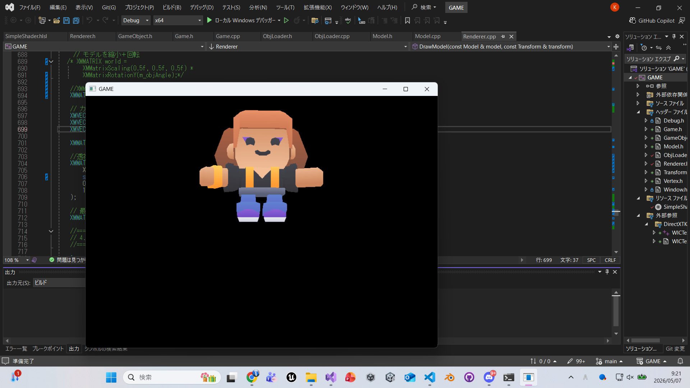

# DirectXGame

DirectX11を使用して作成している C++ のゲームプロジェクトです。

## 概要
DirectX11を用いた描画処理の学習と、就職作品としての開発を目的に制作しています。  
現在はOBJモデルの読み込み機能に加え、MTLファイルとテクスチャの読み込みまで対応し、  
3Dモデルの描画処理の流れを一通り実装しています。

---

## 現在の実装内容

### 描画基盤
- DirectX11の初期化
- Rendererクラスによる描画管理
- 深度バッファ（Zバッファ）
- WVP行列（World / View / Projection）

### 描画機能
- 三角形の描画
- OBJモデルの描画
- テクスチャ付きOBJモデルの描画

### モデル読み込み
- OBJファイルの読み込み
- 頂点（position）・法線（normal）・UV・カラーに対応
- ポリゴンの三角形分割（扇形分割）

### MTL / テクスチャ対応（今回追加）
- OBJ内の `mtllib` を解析
- MTLファイルの読み込み
- `map_Kd` からテクスチャパス取得
- WICTextureLoader による画像読み込み
- `ID3D11ShaderResourceView` の生成
- `PSSetShaderResources` によるピクセルシェーダーへの転送
- SamplerState によるテクスチャサンプリング設定

### シェーダー
- HLSLによる頂点シェーダー・ピクセルシェーダー
- InputLayoutの拡張（POSITION / NORMAL / TEXCOORD / COLOR）
- テクスチャサンプリング対応（Texture2D / SamplerState）

### 設計
- Model / Transform / GameObject による責務分離
- std::vector による複数オブジェクト管理
- DrawModel() による描画の汎用化

### デバッグ
- Debugログシステムの実装
- シェーダーコンパイルエラーの詳細出力


## 使用技術
- C++
- DirectX11
- HLSL
- Visual Studio
- Git / GitHub

## 実行方法
1. Visual Studio で `GAME.sln` を開く
2. ビルド構成を `Debug` または `Release` に設定
3. 実行する
## 実行結果

### OBJ形式のテクスチャ付きモデルの描画


改良版OBJLoaderを用いて読み込んだテクスチャ付きモデルを描画した結果

## 理解したこと

### OBJモデル読み込み
OBJファイルの構造（v, vt, vn, f）を理解し、
頂点・UV・法線を組み合わせて描画データを構築する流れを学びました。

また、四角形ポリゴンを三角形に分割する処理（扇形分割）を実装し、
GPUで描画可能な三角形リストへ変換する重要性を理解しました。

### MTLとテクスチャ
OBJは形状のみを持ち、見た目（テクスチャ）はMTLに定義されていることを理解しました。

以下の流れで描画されることを確認しました：

```text
OBJ
↓
mtllib
↓
MTL
↓
map_Kd
↓
texturePath
↓
WICTextureLoader
↓
ID3D11ShaderResourceView
↓
PSSetShaderResources
↓
HLSLでサンプリング
```

### UVと座標系の違い
OBJのUV座標とDirectXのテクスチャ座標はV方向が逆になる場合があり、  
そのまま使用するとテクスチャが正しく表示されないことを確認しました。

現在はシェーダー側で以下のように補正しています。

```hlsl
float2 uv = float2(input.uv.x, 1.0f - input.uv.y);
```

### デバッグログ
デバッグ用のログ出力関数を実装し、処理の流れやエラーの可視化を行いました。

- Error：エラー発生時のログ
- Info：正常動作の確認
- Log：処理の流れの確認

また、シェーダーコンパイルエラーは詳細ログを出力することで、
問題箇所の特定が容易になることを理解しました。

## 現在の課題

- テクスチャを持たないモデルが黒く描画される
- テクスチャあり / なしの分岐処理が未整理
- Materialクラスが未実装（Modelにテクスチャを持たせている状態）
- MTLの複数マテリアル未対応
- UVの反転処理がシェーダー依存になっている

## 今後の実装予定
- テクスチャあり / なしの描画分岐（またはシェーダー分離）
- Materialクラスの導入
- 複数マテリアル対応
- カメラ制御（自由視点）
- ライティング（法線の活用）
- シーン管理
- コードの整理（不要コード削除・構造改善）

## 制作意図
DirectX を用いたゲーム開発の基礎理解と、設計・描画・管理の流れを段階的に学ぶために制作しています。  
機能を一つずつ実装しながら、ゲームとして完成度を高めていく予定です。
