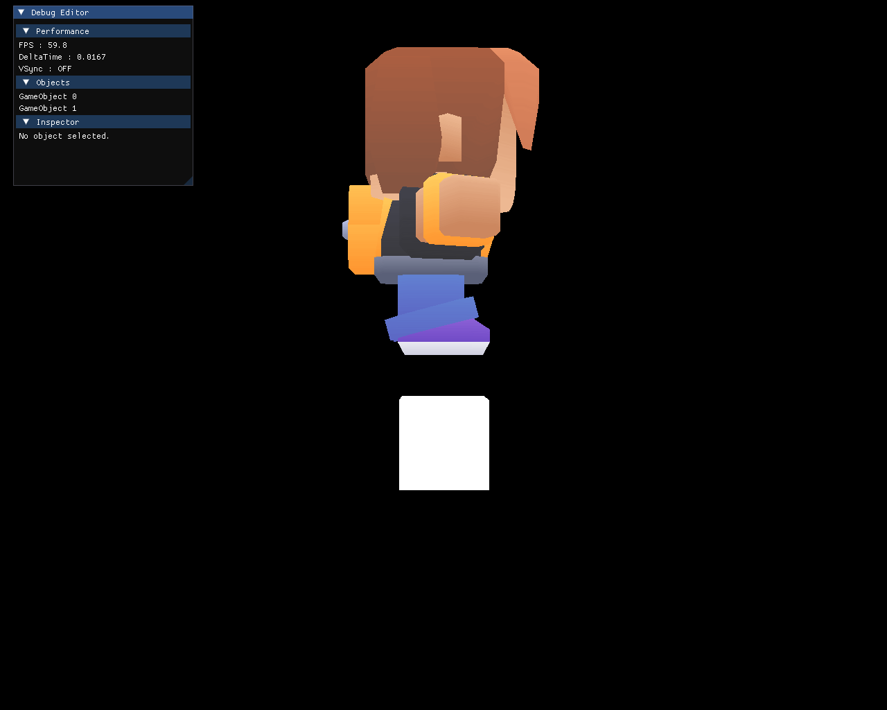
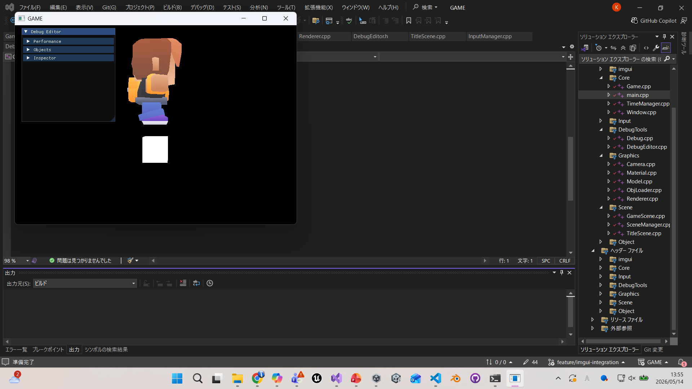
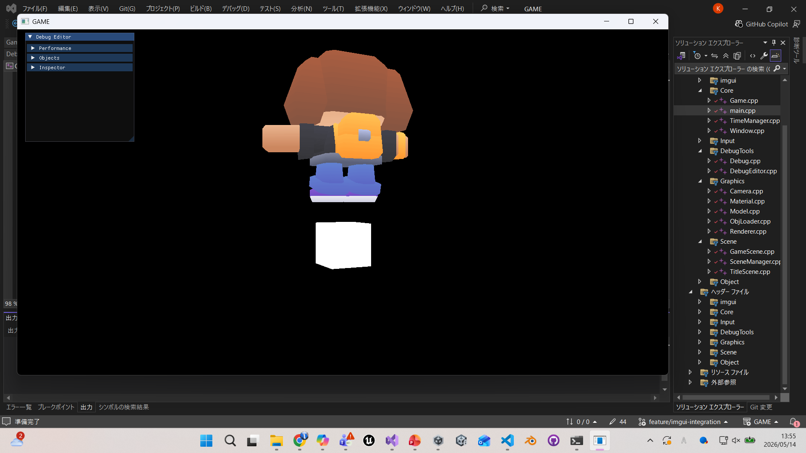

# DirectXGame

DirectX11を使用して作成している C++ のゲームプロジェクトです。

## 概要
DirectX11を用いた描画処理の学習と、就職作品としての開発を目的に制作しています。  
現在はOBJモデルの読み込み機能に加え、MTLファイルとテクスチャの読み込みまで対応し、  
3Dモデルの描画処理の流れを一通り実装しています。

---

## 現在の実装内容

  ├ 描画
  ├ モデル / Material
  ├ Scene
  ├ Input
  ├ Time
  ├ Debug / Editor
  ├ GameObject / Transform
  └ Window Resize

### グリッド建物配置（プロトタイプ）

10×10のマス目から配置場所を選び、仮の建物を設置できます。

- マウス移動: マスを選択
- 左クリック: 建物を配置
- 右クリック: 選択中の建物を撤去
- コントローラー十字キー: マスを選択
- Aボタン: 建物を配置
- Bボタン: 選択中の建物を撤去

緑色は配置可能な選択マス、赤色は建物が配置済みの選択マスです。
青色の直方体は配置前のプレビュー、茶色の直方体は配置済みの仮建物です。

デバッグビルドでは `Grid Settings` ウィンドウの `Width` と `Depth` から、
地面を1×1～30×30マスの範囲で変更できます。地面を縮小して非表示になった範囲の
建物は保持され、再び地面を広げると表示されます。

### 道路とNPC（プロトタイプ）

デバッグビルドの `Grid Settings` で `Road` を選択すると道路配置モードになります。

- 左クリック / Aボタン: 道路を配置
- 右クリック / Bボタン: 道路を撤去
- `Building`: 建物配置モードへ戻す
- `NPC Speed`: NPCの移動速度を変更

道路を1マス以上設置すると黄色の仮NPCが出現します。NPCは上下左右につながった道路だけを使い、
接続されている道路の端から端まで自動的に往復します。道路が途切れた場合は、現在位置から
到達できる道路で経路を再計算します。

### 配置物カタログ

建物と道路は `Simulation/PlacementDefinition.h` の配置物カタログで管理します。
ID、表示名、種類、OBJモデル、上書きテクスチャ、サイズ、表示位置、色、プレビュー色を
1つの定義として追加できます。デバッグGUIの `Type` から種類を選択でき、現在は仮素材として
建物2種類（House / Shop）、道路2種類（Asphalt / Stone）を用意しています。

OBJが参照するMTLのテクスチャに加え、定義の `texturePath` を指定すると任意の画像で
上書きできます。実素材を追加するときは、配置処理を変更せずカタログへ項目を追加します。

### ゲーム内時間と時間HUD

ゲーム内時間は実時間のDeltaTimeを使って更新するため、フレームレートに依存しません。
初期時刻は1日目の08:00で、標準では実時間1秒につきゲーム内10分進みます。

- 右上HUD: 日数と時刻を常時表示
- `Hour`: デバッグ中の時刻変更
- `Minutes / real second`: 時間倍率の変更
- `Pause time`: 時間の一時停止
- `Time HUD offset / opacity`: HUD位置と透明度の調整

描画側には毎フレーム `timeOfDay01`（1日の進行度）と `daylight01`（昼の明るさ）を
HLSLの `WorldTimeBuffer` として渡しています。今後の昼夜・照明シェーダーはこの値を利用できます。

HUDは `UI/HudElementLayout.h` にアンカー、座標、基準点、サイズ、透明度、素材パスを持つ
再利用可能なレイアウト定義を用意しています。時間表示以外のUI素材も同じ形式で追加し、
画面上の任意位置へ配置できる構成です。

## 使用技術
- C++
- DirectX11
- HLSL
- Dear ImGui
- Visual Studio
- Git / GitHub

## 実行方法
1. Visual Studio で `GAME.sln` を開く
2. ビルド構成を `Debug` または `Release` に設定
3. 実行する
## 実行結果

### Debug Editor

### Resizable

## 理解したこと

### ImGuiによるデバッグエディタ

Dear ImGuiを導入し、ゲーム実行中に内部状態を確認・編集できるデバッグエディタを実装しました。

現在は以下の情報を表示・編集できます。

- FPS / DeltaTime
- VSync状態
- GameObject一覧
- 選択中ObjectのTransform
- Position / Rotation / Scaleの編集

また、Inspector表示では内部処理用のラジアン値をGUI上では度数として扱うことで、編集しやすい形にしました。

DebugEditorはGameContext経由でRenderer、TimeManager、GameObject一覧へアクセスする構造にし、引数が増え続ける問題を避けました。

### ウィンドウリサイズ対応

ウィンドウサイズ変更時にSwapChain、RenderTargetView、DepthStencilView、Viewportを再生成する処理を実装しました。

また、サイズ変更時にCameraのProjection行列も更新することで、最大化やウィンドウサイズ変更後も描画比率やGUIのクリック位置がずれないようにしました。

WindowはGameを直接保持せず、リサイズ通知をコールバックで渡す構造にすることで、WindowとGameの依存を減らしました。

## 現在の課題

- 複数マテリアル対応
- カメラ制御（追従 / 自由視点）
- ライティング（法線の活用）
- デバッグエディタの拡張
  - Object生成
  - 画面上のObject選択
  - Gizmoによる移動・回転・拡縮
- ステージエディタ作成
- ステージデータの保存 / 読み込み
- サウンドシステム
- リソース管理の整理

## 今後の実装予定

- デバッグエディタ拡張
  - Gizmo操作
  - Object生成
  - Scene上でのObject選択

- 初期マップ作成
- カメラ制御
- フィールド移動実装

## 制作意図
DirectX を用いたゲーム開発の基礎理解と、設計・描画・管理の流れを段階的に学ぶために制作しています。  
機能を一つずつ実装しながら、ゲームとして完成度を高めていく予定です。

