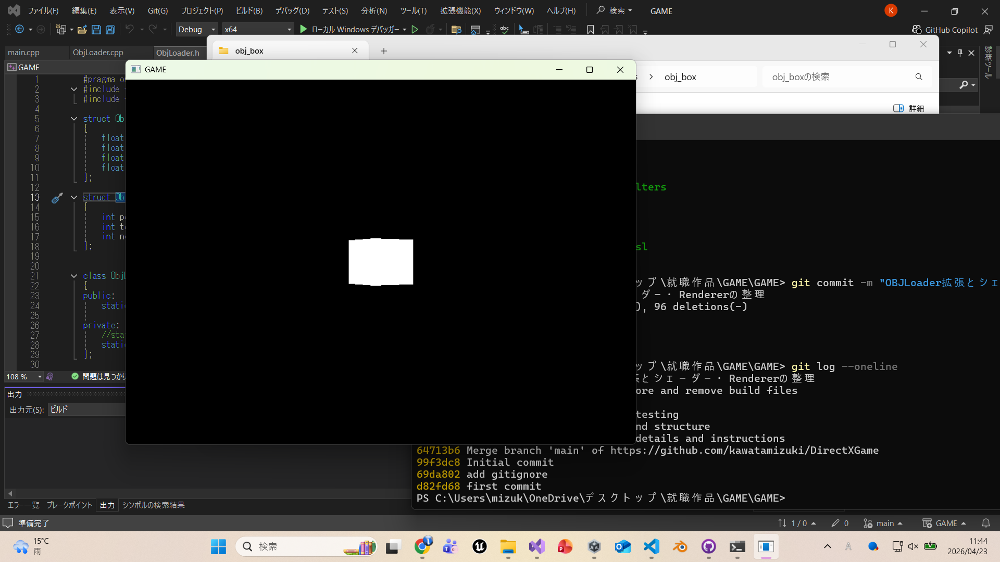

# DirectXGame

DirectX11を使用して作成している C++ のゲームプロジェクトです。

## 概要
DirectX11を用いた描画処理の学習と、就職作品としての開発を目的に制作しています。
現在はOBJモデルの読み込み機能を実装し、頂点・法線・UVを用いた3D描画の基礎と、  
デバッグログによる開発効率の向上を行っています。

## 現在の実装内容

### 描画基盤
- DirectX11の初期化
- Rendererクラスによる描画管理
- 深度バッファ（Zバッファ）
- WVP行列（World / View / Projection）

### 描画機能
- 三角形の描画
- OBJモデルの描画

### モデル読み込み
- OBJファイルの読み込み
- 頂点（position）・法線（normal）・UV・カラーに対応
- ポリゴンの三角形分割（扇形分割）

### シェーダー
- HLSLによる頂点シェーダー・ピクセルシェーダー
- InputLayoutの拡張（POSITION / NORMAL / TEXCOORD / COLOR）

### デバッグ・設計
- Debugログシステムの実装
- Rendererのリファクタリング（マジックナンバー削減・ログ追加）

## 使用技術
- C++
- DirectX11
- HLSL
- Visual Studio
- Git / GitHub

## 実行方法
1. Visual Studio で `GAME.sln` を開く
2. ビルド構成を `Debug` または `Release` に設定
3. 実行する
## 実行結果

### OBJ形式のBOXの描画

簡易OBJLoaderを用いて読み込んだモデルを描画した結果

## 理解したこと

### OBJモデル読み込み
OBJファイルの構造（v, vt, vn, f）を理解し、
頂点・UV・法線を組み合わせて描画データを構築する流れを学びました。

また、四角形ポリゴンを三角形に分割する処理（扇形分割）を実装し、
GPUで描画可能な三角形リストへ変換する重要性を理解しました。

### デバッグログ
デバッグ用のログ出力関数を実装し、処理の流れやエラーの可視化を行いました。

- Error：エラー発生時のログ
- Info：正常動作の確認
- Log：処理の流れの確認

また、シェーダーコンパイルエラーは詳細ログを出力することで、
問題箇所の特定が容易になることを理解しました。

## 今後の実装予定
- カメラ制御（自由視点）
- 複数モデルの管理（GameObject化）
- テクスチャ付きOBJモデルの対応（.mtl・画像読み込み）
- ライティング（法線の活用）
- テクスチャ描画（UVの活用）
- シーン管理

## 制作意図
DirectX を用いたゲーム開発の基礎理解と、設計・描画・管理の流れを段階的に学ぶために制作しています。  
機能を一つずつ実装しながら、ゲームとして完成度を高めていく予定です。
